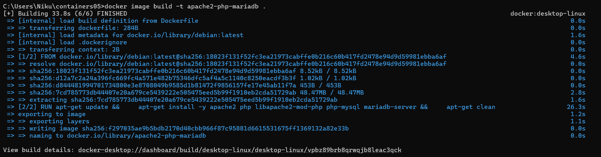
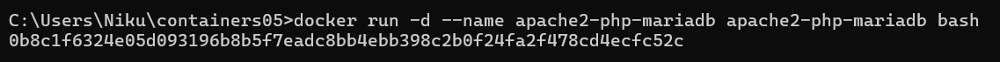
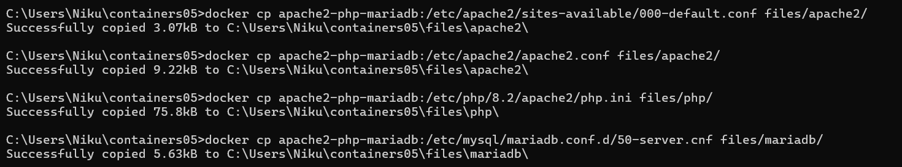
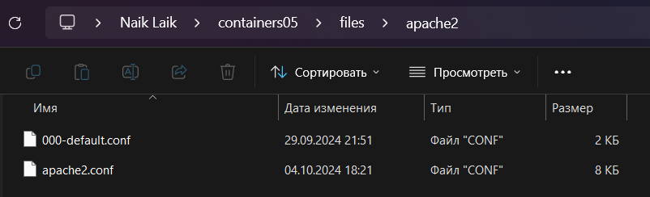
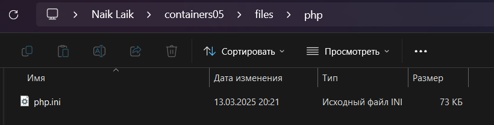
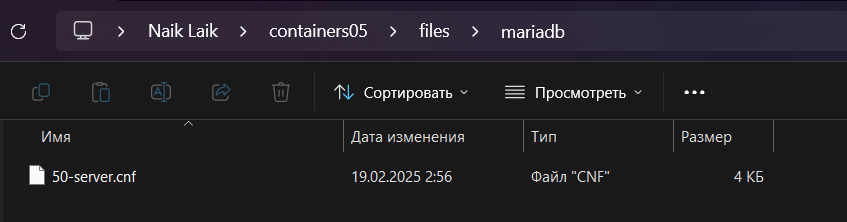
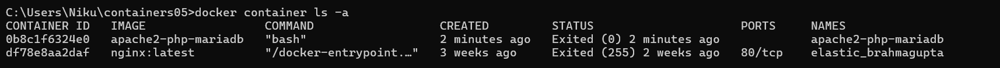
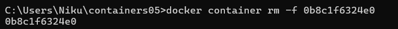
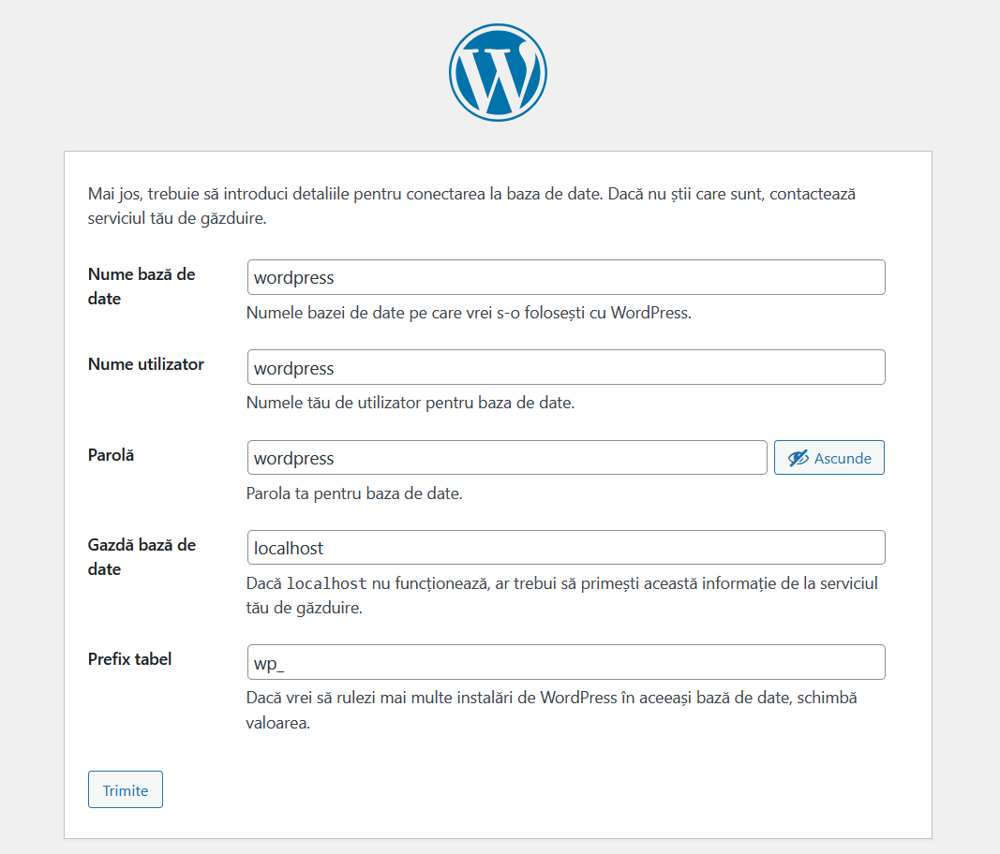
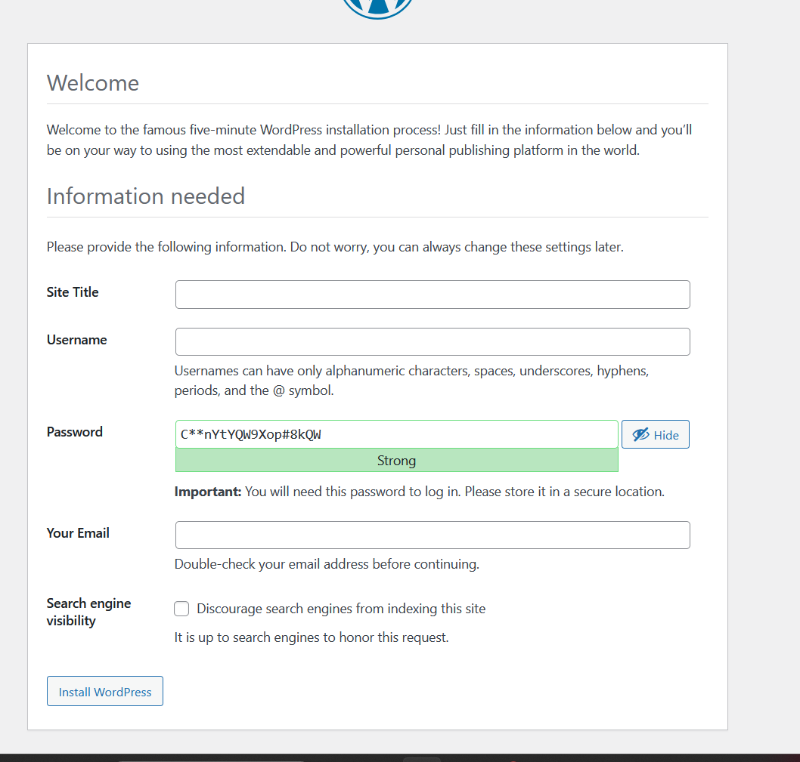

# IWNO5: Rularea site-ului într-un container

## Scopul lucrării

Dupa executarea acestei lucrări, studentul va fi capabil să pregătească un container pentru a rula un site web bazat pe Apache HTTP Server + PHP (mod_php) + MariaDB.
## Sarcina

Creați un fișier Dockerfile pentru a construi o imagine a containerului care va conține un site web bazat pe Apache HTTP Server + PHP (mod_php) + MariaDB. Baza de date MariaDB trebuie să fie stocată într-un volum montat. Serverul trebuie să fie disponibil pe portul 8000.

Instalați site-ul WordPress. Verificați funcționarea site-ului.
## Pregătire

Pentru a efectua această lucrare, trebuie să aveți instalat pe computer Docker.

Pentru a efectua această lucrare, trebuie să aveți experiență în efectuarea lucrării de laborator nr. 4.
## Executare

### Extragerea fișierelor de configurare apache2, php, mariadb din container

Creați un depozit de cod sursă containers05 și clonați-l pe computerul dvs.

Creați în directorul containers05 un director files, precum și

    directorul files/apache2 - pentru fișierele de configurare apache2;
    directorul files/php - pentru fișierele de configurare php;
    directorul files/mariadb - pentru fișierele de configurare mariadb.

Creați în directorul containers04 fișierul Dockerfile cu următorul conținut:

    # create from debian image
    FROM debian:latest

    # install apache2, php, mod_php for apache2, php-mysql and mariadb
    RUN apt-get update && \
    apt-get install -y apache2 php libapache2-mod-php php-mysql mariadb-server && \
    apt-get clean

Construiți o imagine a containerului cu numele apache2-php-mariadb.

    docker build -t apache2-php-mariadb .



Creați un container apache2-php-mariadb din imaginea apache2-php-mariadb și porniți-l în modul de fundal cu comanda bash.

    docker run -d --name apache2-php-mariadb apache2-php-mariadb bash



Copiați din container fișierele de configurare apache2, php, mariadb în directorul files/ de pe computer. Pentru a face acest lucru, în contextul proiectului, executați comenzile:

    docker cp apache2-php-mariadb:/etc/apache2/sites-available/000-default.conf files/apache2/
    docker cp apache2-php-mariadb:/etc/apache2/apache2.conf files/apache2/
    docker cp apache2-php-mariadb:/etc/php/8.2/apache2/php.ini files/php/
    docker cp apache2-php-mariadb:/etc/mysql/mariadb.conf.d/50-server.cnf files/mariadb/



După executarea comenzilor, în directorul files/ ar trebui să apară fișierele de configurare apache2, php, mariadb. Verificați dacă acestea există. Opriți și ștergeți containerul apache2-php-mariadb.




Afisam lista containerelor:

Stergem:


### Configurarea fișierul de configurare apache2

Deschideți fișierul files/apache2/000-default.conf, găsiți linia 

    #ServerName www.example.com și înlocuiți-o cu ServerName localhost.

Găsiți linia ```ServerAdmin webmaster@localhost``` și înlocuiți adresa de e-mail cu a dvs.

După linia ```DocumentRoot /var/www/html``` adăugați următoarea linie:

    DirectoryIndex index.php index.html

Salvați fișierul și închideți-l.

La sfârșitul fișierului ```files/apache2/apache2.conf``` adăugați următoarea linie:

    ServerName localhost

### Fișierul de configurare php

Deschideți fișierul ```files/php/php.ini```, găsiți linia ```;error_log = php_errors.log``` și înlocuiți-o cu ```error_log = /var/log/php_errors.log```.

Setați parametrii memory_limit, upload_max_filesize, post_max_size și max_execution_time astfel:

    memory_limit = 128M
    upload_max_filesize = 128M
    post_max_size = 128M
    max_execution_time = 120

Salvați fișierul și închideți-l.

### Fișierul de configurare mariadb

Deschideți fișierul ```files/mariadb/50-server.cnf```, găsiți linia ```#log_error = /var/log/mysql/error.log``` și eliminați # din fața ei.

Salvați fișierul și închideți-l.

### Crearea scriptului de pornire

In directorul ```files``` creati directorul ```supervisor``` si fisierul ```supervisord.conf``` cu urmatorul continut:

    [supervisord]
    nodaemon=true
    logfile=/dev/null
    user=root

    # apache2
    [program:apache2]
    command=/usr/sbin/apache2ctl -D FOREGROUND
    autostart=true
    autorestart=true
    startretries=3
    stderr_logfile=/proc/self/fd/2
    user=root

    # mariadb
    [program:mariadb]
    command=/usr/sbin/mariadbd --user=mysql
    autostart=true
    autorestart=true
    startretries=3
    stderr_logfile=/proc/self/fd/2
    user=mysql

### Crearea Dockerfile

Deschiți fișierul Dockerfile și modificatil:

    # create from debian image
    FROM debian:latest

    # mount volume for mysql data
    VOLUME /var/lib/mysql

    # mount volume for logs
    VOLUME /var/log

    # install supervisor, apache2, php, mod_php for apache2, php-mysql and mariadb
    RUN apt-get update && \
        apt-get install -y supervisor apache2 php libapache2-mod-php php-mysql mariadb-server && \
        apt-get clean

    ADD https://wordpress.org/latest.tar.gz /var/www/html/

    RUN tar -xzf /var/www/html/latest.tar.gz -C /var/www/html --strip-components=1 && \
        rm /var/www/html/latest.tar.gz && \
        chown -R www-data:www-data /var/www/html

    # copy the configuration file for apache2 from files/ directory
    COPY files/apache2/000-default.conf /etc/apache2/sites-available/000-default.conf
    COPY files/apache2/apache2.conf /etc/apache2/apache2.conf

    # copy the configuration file for php from files/ directory
    COPY files/php/php.ini /etc/php/8.2/apache2/php.ini

    # copy the configuration file for mysql from files/ directory
    COPY files/mariadb/50-server.cnf /etc/mysql/mariadb.conf.d/50-server.cnf

    # copy the supervisor configuration file
    COPY files/supervisor/supervisord.conf /etc/supervisor/supervisord.conf

    # copy the configuration file for wordpress from files/ directory
    COPY files/wp-config.php /var/www/html/wordpress/wp-config.php

    # create mysql socket directory
    RUN mkdir /var/run/mysqld && chown mysql:mysql /var/run/mysqld

    EXPOSE 80

    # start supervisor
    CMD ["/usr/bin/supervisord", "-n", "-c", "/etc/supervisor/supervisord.conf"]

Creati imaginea containerului cu numele ```apache2-php-mariadb``` și porniți containerul ```apache2-php-mariadb``` din imaginea ```apache2-php-mariadb```. 

    docker build -t apache2-php-mariadb .
    docker run -d --name apache2-php-mariadb -p 80:80 apache2-php-mariadb

Verificați dacă site-ul WordPress este disponibil la adresa [localhost](http://localhost/). Verificați dacă in directorul ```/var/www/html/``` există fișierele site-ului WordPress. Verificați dacă fișierele de configurare apache2, php, mariadb sunt modificate.

Daca totul e ok trebui sa vedem:


### Crearea bazelor de date și a utilizatorului pentru WordPress

Crearea bazelor de date și a utilizatorului pentru WordPress se face în containerul ```apache2-php-mariadb```. Pentru a face acest lucru, conectați-vă la containerul ```apache2-php-mariadb```

    docker exec -it apache2-php-mariadb mysql


 și executați comenzile:

    CREATE DATABASE wordpress;
    CREATE USER 'wordpress'@'localhost' IDENTIFIED BY 'wordpress';
    GRANT ALL PRIVILEGES ON wordpress.* TO 'wordpress'@'localhost';
    FLUSH PRIVILEGES;
    EXIT;

### Crearea fișierului de configurare WordPress

Deschideți în browser site-ul WordPress la adresa http://localhost/ și urmați instrucțiunile pentru instalarea site-ului WordPress. La pasul 2, specificați următoarele date:

    Numele bazei de date: wordpress;
    Utilizatorul bazei de date: wordpress;
    Parola bazei de date: wordpress;
    Adresa bazei de date: localhost;
    Prefixul tabelelor: wp_.


Dupa urmatorul pas copiați conținutul fișierului wp-config.php și salvați-l în fișierul files/wp-config.php. Care il putem gasi in directorul ```/var/www/html``` inautrul containerului. Sau prin comenzi sau cu ajutorul aplicatiei docker.desktop


### Adăugarea fișierului de configurare WordPress în Dockerfile

Adăugați în fișierul Dockerfile următoarele linii:

    # copy the configuration file for wordpress from files/ directory
    COPY files/wp-config.php /var/www/html/wp-config.php

### Pornirea și testarea

Recreați imaginea containerului cu numele apache2-php-mariadb și porniți containerul apache2-php-mariadb din imaginea apache2-php-mariadb. Verificați funcționarea site-ului WordPress.

    docker build -t apache2-php-mariadb .
    docker run -d --name apache2-php-mariadb -p 80:80 apache2-php-mariadb

Creem din nou baza de date in mysql si trecem pe localhost:


Vedem ca totul lucreaza.

## Răspundeți la întrebările:

* Ce fișiere de configurare au fost modificate?
    
    *wp-config.php*

* Pentru ce este responsabilă instrucția DirectoryIndex din fișierul de configurare apache2?

    *DirectoryIndex din Apache definește numele fișierului implicit care va fi accesat când un utilizator accesează localhost fara sa indice un file exact*
    

* De ce este necesar fișierul wp-config.php?
    
    *In el este configurata baza de date pentru WordPress cu user name paroal etc. care permit aplicației să se conecteze corect la baza de 
    date*

* Pentru ce este responsabil parametrul post_max_size din fișierul de configurare php?

    *El controleaza marimea maxima a datelor care pot fi trimise prin HTTP POST*

* Specificați, în opinia dvs., care sunt deficiențele imaginii containerului creat?

    *Noi trebuie de fiecare data sa configuram baza de date in container dupa ce il creem de aceea eu consider ca acest lucru ar fi bine de automatizat*

## Concluzie

Am creat un fișier Dockerfile pentru a construi o imagine a containerului care va conține un site web bazat pe Apache HTTP Server + PHP (mod_php) + MariaDB. Am instalați site-ul WordPress si lam configurat ca sa functioneze. Am devenit capabili sa pregatesc un container pentru a rula un site web bazat pe Apache HTTP Server + PHP (mod_php) + MariaDB. Am inteles mai bine cum functioneaza si am capatat mai multa experienta cu dockerul. Chiar si daca am intalnit unele probleme dar modifiacnd calea sau comada de baza am ajuns la final.